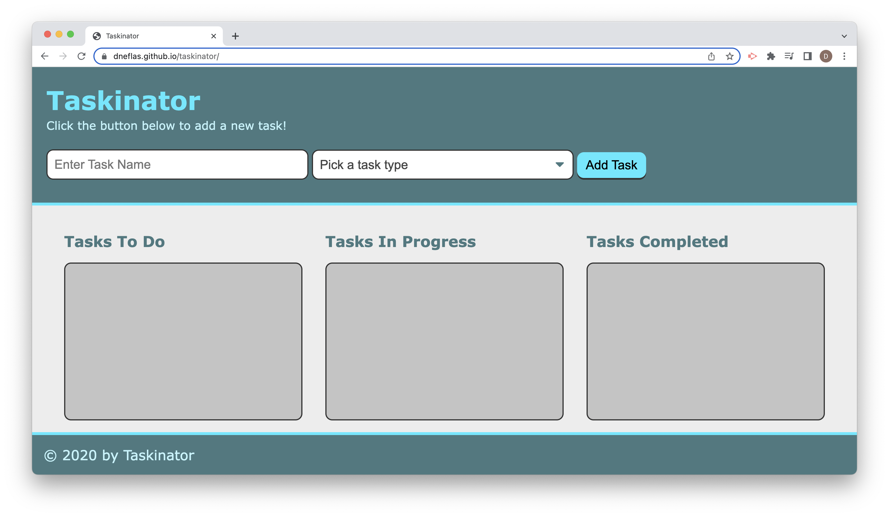

# Taskinator

## Description
Taskinator is a simple task management application. It features the ability to create and edit tasks, and assign them to either "Tasks To Do", "Tasks In Progress", or "Tasks Completed". Tasks are saved to local storage. The application was built using Javascript.

https://dneflas.github.io/taskinator/